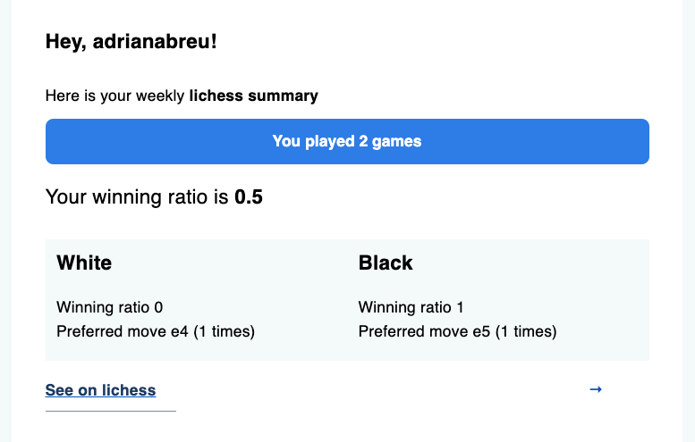

# Lichess Report Generator

This project queries the Lichess API using the `berserk` library, generates a report based on the data retrieved, and sends the report via email using Mailtrap.

## Example

## Table of Contents

- [Installation](#installation)
- [Configuration](#configuration)
- [Usage](#usage)

## Installation

Simply configure poetry and run `poetry install`

## Usage

Run the main script to generate the report and send it via email:

`poetry run python main.py`

The script will:
- Query the Lichess API using the berserk library.
- Generate a report based on the retrieved data.
- Send the report via email using Mailtrap.