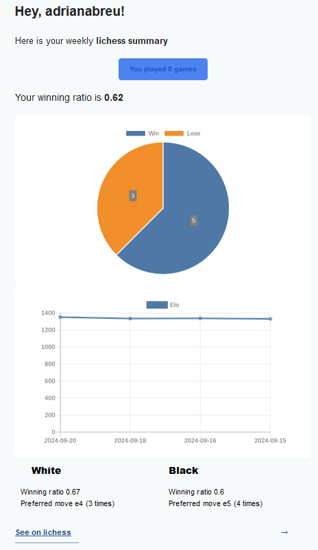

# Lichess Report Generator

This project queries the [Lichess API](https://lichess.org/api) using the [berserk](https://pypi.org/project/berserk/) library, generates a report based on the data retrieved, and sends the report via email using [Mailtrap](https://mailtrap.io/).

## Example



## Table of Contents

- [Installation](#installation)
- [Configuration](#configuration)
- [Usage](#usage)

## Installation

Enjoy the installation by using [uv](https://github.com/astral-sh/uv)

Run:
```sh
uv python install 3.11
uv sync
```

## Configuration

Modify the existing settings.toml to include the mandatory variables:

```
username = "your_username"
sender_mail = "your_source_mail@example.com"
sender_name = "test"
recipients = ["recipient1@example.com", "recipient2@example.com"]
template_uid = "your_template_uid"
mail_token = "your_mail_token"
```


## Usage


Run the main script to generate the report and send it via email:

`uv python run main.py`

The script will:
- Query the Lichess API using the berserk library.
- Generate a report based on the retrieved data.
- Send the report via email using Mailtrap.